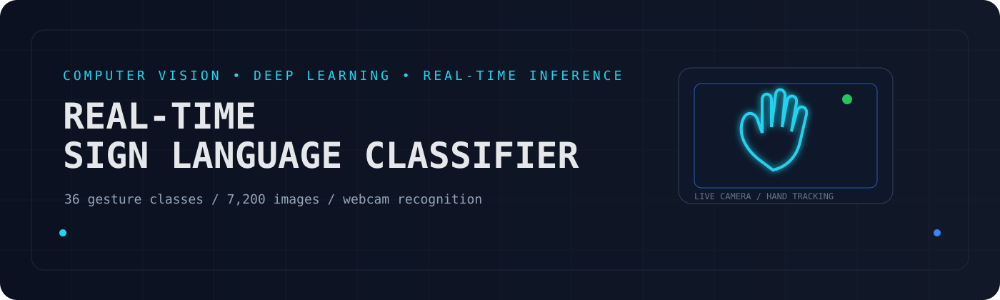
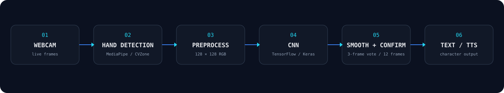
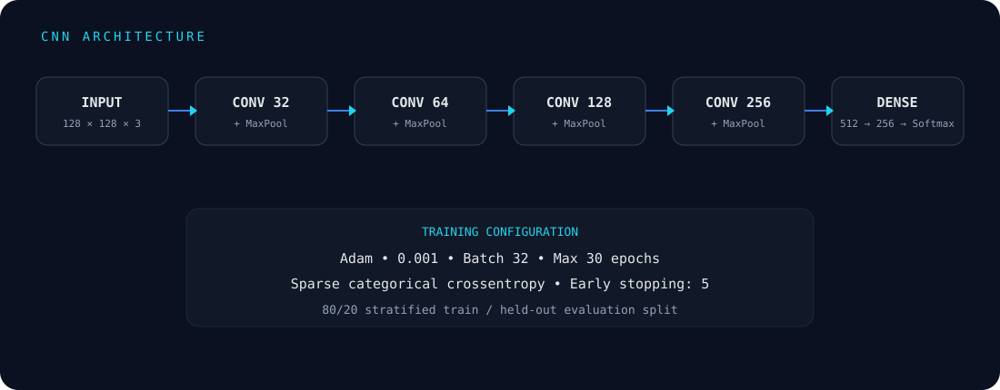

# Real-Time Sign Language Classifier

<p align="center">
  
</p>

<p align="center">
  <strong>Real-time hand-gesture recognition using computer vision and deep learning.</strong><br>
  Recognises A–Z and 0–9 gestures from a webcam, converts confirmed predictions into text, and optionally speaks the recognised characters.
</p>

<p align="center">


</p>

---

## `01` — Overview

**Real-Time Sign Language Classifier** is a computer vision and deep learning project for recognising hand gestures representing **26 letters and 10 digits**.

The system combines webcam-based hand detection, image preprocessing, a custom convolutional neural network (CNN), prediction smoothing, and optional text-to-speech.

### Project snapshot

| | |
|---|---|
| **Classes** | 36 — A–Z + 0–9 |
| **Dataset** | 7,200 collected images |
| **Images / class** | 200 |
| **Input** | Live webcam |
| **Hand** | Right hand |
| **Model** | Custom CNN |
| **Framework** | TensorFlow / Keras |
| **Inference** | Real time |
| **Output** | Characters / text + optional TTS |

---

## `02` — What It Does

- Captures and organises hand-gesture images through a webcam
- Trains a custom CNN using the collected dataset
- Detects the right hand in a live camera feed
- Classifies gestures into A–Z and 0–9
- Smooths predictions across recent frames
- Requires repeated confirmation before adding a character
- Builds text from recognised characters
- Supports space, backspace, and clear controls
- Provides optional text-to-speech using `pyttsx3`
- Saves trained models, class mappings, and training-history plots

---

## `03` — Recognition Pipeline

<p align="center">
  
</p>

The live pipeline is:

**Webcam → Hand Detection → Preprocessing → CNN Classification → Prediction Smoothing → Character Confirmation → Text / TTS**

---

## `04` — Dataset

The project uses a custom webcam-collected dataset containing:

**36 classes × 200 images = 7,200 images**

```text
dataset/
├── 0/ ... 9/
└── A/ ... Z/
```

The collection utility:

- detects the hand using CVZone / MediaPipe
- crops the right hand with padding
- preserves the hand's aspect ratio
- places the crop on a 300 × 300 white canvas
- saves the image as a JPG
- supports manual and automatic capture
- limits collection to 200 images per class

The training pipeline then resizes each image to **128 × 128**, converts it to RGB, and normalises pixel values to `[0, 1]`.

> The dataset is collected specifically for this project; it is not an external benchmark dataset.

### Dataset utilities

```bash
python scripts/check_dataset.py
```

Reports the number of images available for each class.

```bash
python scripts/delete_all_images.py
```

Clears collected images from the class directories when a fresh dataset needs to be captured.

---

## `05` — Model

<p align="center">
  
</p>

The classifier is a custom CNN built with TensorFlow/Keras.

### Training configuration

| Parameter | Value |
|---|---|
| Image size | 128 × 128 |
| Batch size | 32 |
| Maximum epochs | 30 |
| Optimiser | Adam |
| Learning rate | 0.001 |
| Loss | Sparse categorical crossentropy |
| Split | 80% training / 20% held-out evaluation |
| Early stopping | Patience 5 |
| Checkpointing | Best model saved |

The model contains four convolutional blocks followed by fully connected layers:

```text
Conv 32 → MaxPool
Conv 64 → MaxPool
Conv 128 → MaxPool
Conv 256 → MaxPool
        ↓
     Flatten
        ↓
 Dense 512 → Dropout 0.5
        ↓
 Dense 256 → Dropout 0.3
        ↓
 Softmax → class prediction
```

Training history is saved to:

```text
models/training_history.png
```

---

## `06` — Real-Time Inference

The recognition script applies several safeguards before a gesture becomes a character.

### Hand detection

The webcam feed is processed using CVZone's `HandDetector`, built on MediaPipe.

### Preprocessing

The detected hand is:

1. cropped with padding
2. placed on a white square canvas
3. resized to `128 × 128`
4. converted from BGR to RGB
5. normalised to `[0, 1]`

### Prediction

The CNN produces class probabilities. Predictions below a **0.80 confidence threshold** are ignored.

### Smoothing

The system keeps the most recent **3 predictions** and uses their majority result.

### Confirmation

A consistent prediction must persist for **12 frames** before a character is appended to the sentence.

This reduces accidental characters caused by unstable frame-by-frame predictions.

---

## `07` — Controls

| Key | Action |
|---|---|
| `C` | Clear the sentence |
| `Space` | Add a space |
| `Backspace` | Delete the last character |
| `S` | Speak |
| `Esc` | Exit |

Text-to-speech is handled with `pyttsx3` and runs in a background thread.

---

## `08` — Project Structure

```text
Real-Time-Sign-Language-Classifier/
│
├── assets/
│   ├── hero.svg
│   ├── pipeline.svg
│   └── model.svg
│
├── dataset/
│   ├── 0/ ... 9/
│   └── A/ ... Z/
│
├── models/
│   ├── best_model.h5
│   ├── class_mapping.pkl
│   ├── sign_language_final.h5
│   ├── sign_language_final.keras
│   └── training_history.png
│
├── scripts/
│   ├── check_dataset.py
│   ├── collect_data.py
│   ├── delete_all_images.py
│   ├── recognition.py
│   └── train_model.py
│
├── AI Project Demo.mp4
├── AI Project Presentation.pptx
├── AI project proposal.pdf
├── AI Project Report.pdf
├── requirements.txt
├── .gitattributes
├── .gitignore
└── README.md
```

---

## `09` — Installation

### Requirements

- Python
- A working webcam
- `pip`

Clone the repository:

```bash
git clone https://github.com/Umaima-Manzoor/Real-Time-Sign-Language-Classifier.git
cd Real-Time-Sign-Language-Classifier
```

Install dependencies:

```bash
pip install -r requirements.txt
```

---

## `10` — Usage

### Check the dataset

```bash
python scripts/check_dataset.py
```

### Collect new data

```bash
python scripts/collect_data.py
```

### Train the model

```bash
python scripts/train_model.py
```

The training script loads the available class folders, preprocesses the images, creates a stratified 80/20 split, trains the CNN, applies early stopping, saves the best checkpoint, saves the final model files, stores the class mapping, and generates the training-history plot.

### Run real-time recognition

```bash
python scripts/recognition.py
```

The application opens the webcam and begins detecting and classifying hand gestures.

---

## `11` — Saved Models

The repository contains models in both HDF5 and Keras formats:

```text
models/
├── best_model.h5
├── sign_language_final.h5
└── sign_language_final.keras
```

The recognition script attempts to load them in this order:

```text
best_model.h5
      ↓
sign_language_final.h5
      ↓
sign_language_final.keras
```

The corresponding class mapping is stored in:

```text
models/class_mapping.pkl
```

---

## `12` — Documentation

The repository contains the project's original academic materials:

| Resource | File |
|---|---|
| Project demo | `AI Project Demo.mp4` |
| Presentation | `AI Project Presentation.pptx` |
| Proposal | `AI project proposal.pdf` |
| Report | `AI Project Report.pdf` |

---

## `13` — Limitations

This project is a **gesture-classification prototype**, not a complete natural-language sign-language translation system.

Current limitations include:

- recognition is based on individual character and digit gestures
- the current recognition pipeline uses the right hand
- performance can vary with lighting, camera quality, hand positioning, and background conditions
- the model is trained on the project's collected dataset and may not generalise equally to every user or environment
- the training process uses one 80/20 split rather than separate training, validation, and test datasets
- the system does not interpret complete sign-language grammar, facial expressions, body posture, or continuous multi-sign sequences

---

## `14` — Future Improvements

Possible extensions include:

- larger and more diverse datasets
- additional users and environments during data collection
- support for both hands
- improved robustness to lighting and background variation
- dedicated validation and test datasets
- continuous gesture recognition
- word- and sentence-level recognition
- temporal models for gesture sequences
- improved text-to-speech interaction
- standalone desktop packaging

---

## `15` — Project Status

**Academic project — functional prototype**

The project demonstrates an end-to-end pipeline from **custom dataset collection and CNN training to real-time webcam inference, character construction, and optional text-to-speech output**.

---

<p align="center">
  <sub>Built with Python • TensorFlow • Keras • OpenCV • MediaPipe • CVZone</sub>
</p>
